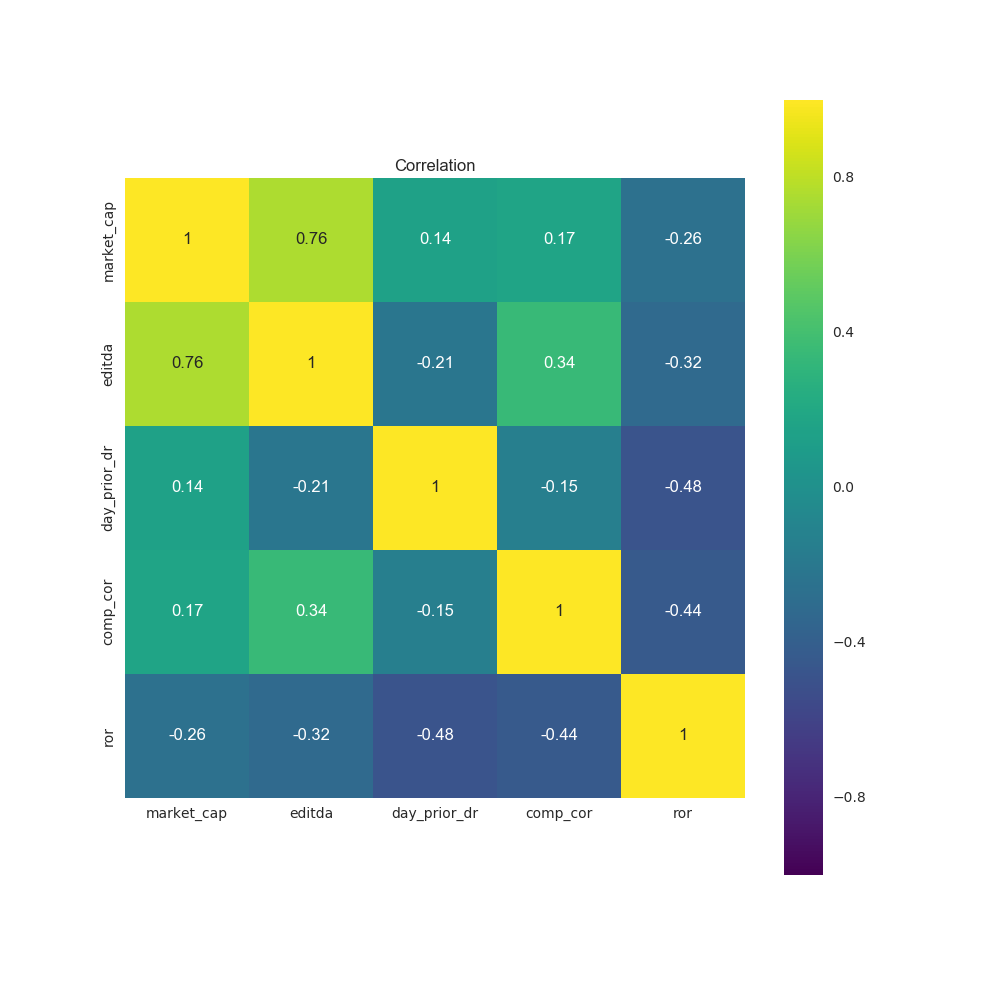

# Regression Project MVP

## Goals

Use web scraping, exploratory data analysis, and linear regression to look at an interesting question related to statistical arbitrage.

## Initial Data Cleaning Approach and Exploratory Findings

I downloaded selected stock prices from Yahoo Finance website using an R script. I then used Python to compile the following features: 'market_cap', 'editda','day_prior_dr','comp_cor' and 'normalized stock volume'.

I relied upon normalized stock volume to investigate investment windows and ultimately chose a particular one from which to establish as my predictor (y) variable.

After cleaning the data, I examined the Scatter Matrix and learned that the variable relationships aren't generally very strong.

### Scatter_Matrix.png

I also investigated correlations among variables which corroborated the above conclusion that factors are weakly correlated to one another.

### Feature_Correlation_Graph

After normalizing price spreads based upon stock trading volume (used Excel), I examined the mean spread ratio for all stocks relative to normalized stock volume.

### Mean_Spread_Ratio

I then established a filter (maskings) function that could be used to further refine the data set based upon particular parameters for each of 'market_cap', 'editda','day_prior_dr' and 'comp_cor'.

I ran a multiple linear regression model with `statsmodels`. The R-squared value was not high (.535) and the p-values inform me that I should probably drop some extraneous variables as I revise my model.

Finally, I loaded the dataset into R in order to determine that the r-squared's matched (they did) and to identify the optimizated linear regression formula (using the 'step' function with direction = 'both' forward and backward).

## Intial Findings

1. **Although a relationship between explanatory and predictor variables may exist, more work needs to be done** - Althgouh the dataset reveals a possible relationship, the fact that the predictor variable (y) was based upon an optimized share volume value, raises the possibility of model overfitting.

2. **Feature Engineering** - 'day_prior_dr' was determined to be the only co-efficient which was statistically significant. Accordingly, substantial improvements could be made identifying and using more powerful features.

## Further Research and Analysis

1. Feature Engineering (mentioned above)
2. Obtain a greater number of sample observations
3. Investigate the variablitiy in investment windows and holding periods
