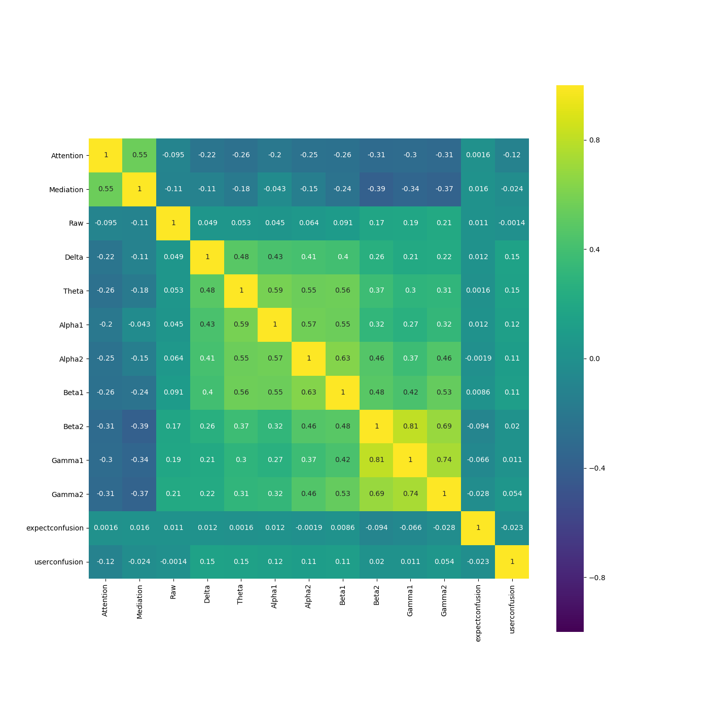
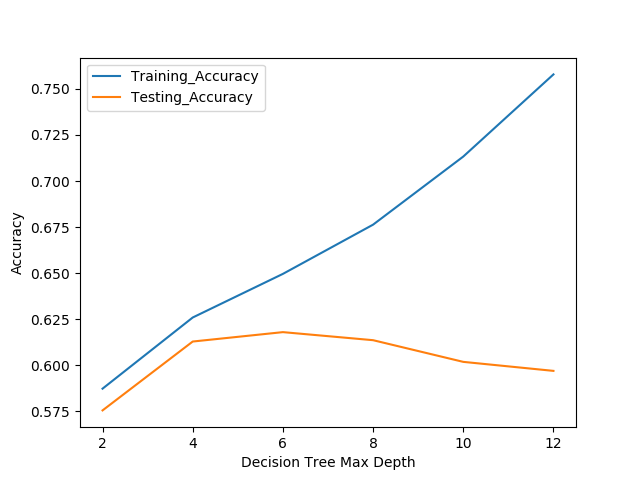
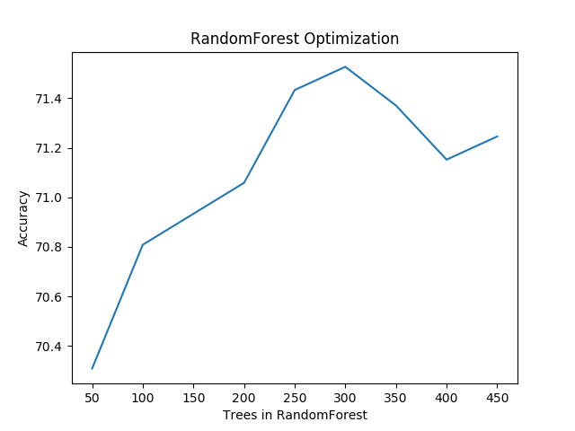
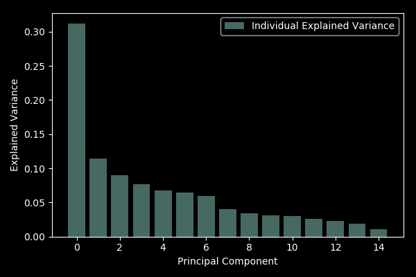

#  K2 Final Project - Dan Cardella                                      EEG Brainwave Analysis (Kaggle Dataset)
#    7/5/2017

## Relevant Questions
In evaluating EEG patterns from 9 subjects when immersed in intellectually challenging exercises, the following analysis set out to answer the principal question of whether participants' state of confusion could be accurately predicted based upon their particular brainwave pattern. Stated differently, how diagnostic are brain wave patterns in betraying subjective state of mind, in this case, confusion ? Secondarily, the analysis sought to quantify the contribution of each of the relevant frequencies Delta, Theta, Alpha, Beta & Gamma (in order of increasing frequency) to determine which was most pronounced when subjects claimed to be in a state of confusion.

Considering the current epidemic proportions of Alzheimers, Dimentia and other neurological condititions, I imagine that these sorts of questions might be of interest to researchers at the National Institute of Health (NIH) or similar health organizations. With the recent advent of affordable, consumer oriented devices for tracking and monitoring individual EEG's, brain wave evaluation may prove to be key in unlocking the detection and treatments doors to these insidious afflictions. 

## Machine Learning Methods Deployed
Considering that the response variable (y) for this particular dataset was binary (ie 1s and 0 for confused or not confused, respectively), I selected Decision Trees (with an associated Random Forest classifier) as a primary classification methodology along with Principal Component Analysis (PCA) as a secondary methodology.  These methods effectively addressed the questions posed above and, relative to other Machine Learning techniques, enjoy the added benefit of interpretability, particularly in the case of Decision Trees.

## Data Set Description

This dataset was comprised of:
i ) 7 male and 2 female subjects all within their 20s with the exception of one 31 year old
ii) 7 Chinese, 1 Indian and 1 of English ethnicity 
iii) 12810 EEG observations across 18 predictors (most relevant being high and low segments of aforementioned frequencies)

The dataset seemed to be sufficiently dense in observations to accomodate all predictors with at least a handful of predictors proving to be incrementally inmaterial in generating accurate predictions. 

Summary Exploratory Data Analysis reveals that the predictors are only casually correlated to one another and to the response variable 'user_confusion':

### Correlation Heat Map

## Findings

1. **Brain Wave Patterns are (somewhat) Indicative of Subjective State of Mind** - Initial results yield optimized Decision Tree and Random Forest prediction accuracies of 65.6% and 71.5%, respectively. These prediction accuracies cautiously suggest that brain waves are likely to be diagnostic of subjects state of confusion. These accuracies should be compared to a Baseline Prediction Accuracy of 51.1%. It should be further noted that these prediction accuracies benefited from optimized methods of Grid Search and Cross Validated techniques to search out the optimum tree depth and number of trees to include within the respective algorithm. For instance, the following Validation Curve reveals that a Decision Tree depth of 4 was ideal, evidentiary of progressively deeper trees being vulnerable to overfit in higher variance scenarios: 

Additionaly, the following graph illustrates that aglomerating 300 Decision Trees produced the highest prediction accuracy amongst all methods:

2. **Explained Variance** Feature Importance and PCA reveal that the first component explains approximately 30% of the data variance. Interestingly, in the case of Feature Importance, this highest ranking predictor turned out to be the lowest predictor frequency Delta waves (1-3 Hz of power spectrum), followed by Attention (a measure of mental focus), Ethnicity and Gamma1. PCA similarly reveals a dramatic fall in variance to 11.5% for component 2 and a fairly gradual decline to 6.5%, for instance, for component 6. At this component level, more than 70% of the cumulative variance is explained.  

Personally, I found the conclusion that 1-3 Hz Delta waves explained the vast proportion of variance as fascinating and provocative. Intuitively, this would seem to comport with the uncomfortable, subjective experience of confusion. Can we think of the lower hz frequency as being comparable to a vehicle that transistions to a lower gear when taking a hill as we 'grind' our analysis out ? Lastly, I wonder whether certain individuals or, as hinted at although insufficient to statistically conclude from this dataset, certain ethnicities are predisposed towards a capacity for 'lower geared' thinking and hence more inclined towards challenging subjects that require concentration and diligence in surmounting that inevitable state of confusion that attends most anything worth learning.  

Kaggle EEG Brainwaves Dataset: https://www.kaggle.com/wanghaohan/eeg-brain-wave-for-confusion